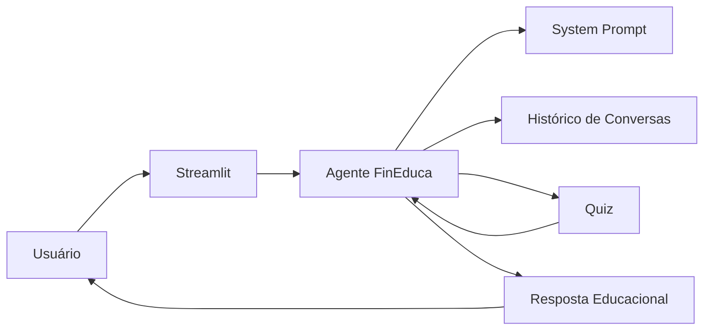

Perfeito, Vinicius. Vamos ajustar a seção de documentação do GitHub para refletir **o seu código original** (Streamlit + Groq + lógica de quiz e histórico). Assim, quem abrir o repositório vai entender exatamente como está estruturado:

---

# Código da Aplicação

Esta pasta contém o código-fonte do **FinEduca**, um agente educacional baseado em Inteligência Artificial para ensino de economia, finanças, investimentos e preparação para certificações ANBIMA (CPA-10 e CPA-20).

## Estrutura do Projeto

```text
src/
├── app.py                    # Interface principal em Streamlit (chat, quiz e histórico)
├── agente.py                 # Lógica de interação do agente (fluxo de mensagens e quiz)
├── prompts.py                # System Prompt e templates de instruções
├── config.py                 # Configurações gerais (chaves, modelos, parâmetros)
├── data/
│   ├── historico_conversas.json   # Histórico de conversas (sessão/local)
│   ├── perfil_investidor.json     # Exemplo de perfil de usuário
│   └── produtos_financeiros.json  # Exemplos de dados de produtos
└── requirements.txt
```

## Componentes

| Arquivo           | Responsabilidade                                                                 |
| ----------------- | -------------------------------------------------------------------------------- |
| `app.py`          | Interface do usuário construída com Streamlit, exibe chat, quiz e histórico.     |
| `agente.py`       | Orquestra o fluxo de perguntas, respostas e lógica de quiz.                      |
| `prompts.py`      | Centraliza o System Prompt e instruções para geração de respostas e testes.      |
| `config.py`       | Configurações do ambiente e do modelo Groq utilizado.                            |
| `data/`           | Armazena dados auxiliares e histórico de conversas.                              |

## Tecnologias Utilizadas

* Python 3.11+
* Streamlit
* Groq API
* Pandas
* JSON

## Exemplo de requirements.txt

```txt
streamlit
pandas
groq
python-dotenv
```

## Como Executar

### 1. Instalar dependências

```bash
pip install -r requirements.txt
```

### 2. Configurar chave da Groq

Crie um arquivo `.env` com sua chave:

```env
GROQ_API_KEY=SUA_CHAVE_AQUI
```

### 3. Executar a aplicação

```bash
streamlit run app.py
```

### 4. Acessar a interface

O Streamlit abrirá automaticamente no navegador:

```text
http://localhost:8501
```

## Fluxo da Aplicação



## Objetivo Técnico

Garantir que todas as respostas sejam:

* Educacionais  
* Didáticas  
* Alinhadas às certificações ANBIMA  
* Livres de recomendações financeiras  
* Baseadas no System Prompt e lógica do projeto  

---

👉 Esse ajuste deixa a documentação **alinhada ao seu código real** (com Groq e Streamlit). Quer que eu também prepare um **README.md completo** já formatado para você colocar direto no GitHub?
