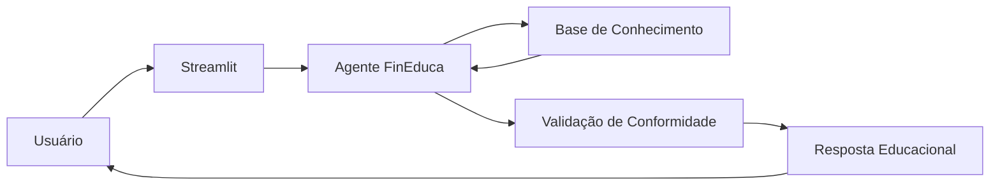

# Código da Aplicação

Esta pasta contém o código-fonte do **FinEduca**, um agente educacional baseado em Inteligência Artificial para ensino de economia, finanças, investimentos e preparação para certificações ANBIMA (CPA-10 e CPA-20).

## Estrutura do Projeto

```text id="6kvw6m"
src/
├── app.py                    # Interface Streamlit
├── agente.py                 # Lógica principal do agente
├── conhecimento.py           # Carregamento da base de conhecimento
├── validacao.py              # Regras de conformidade e anti-alucinação
├── prompts.py                # System Prompt e templates
├── config.py                 # Configurações gerais
├── data/
│   ├── historico_atendimento.csv
│   ├── perfil_investidor.json
│   ├── produtos_financeiros.json
│   └── transacoes.csv
└── requirements.txt
```

## Componentes

| Arquivo           | Responsabilidade                                                                   |
| ----------------- | ---------------------------------------------------------------------------------- |
| `app.py`          | Interface do usuário construída com Streamlit.                                     |
| `agente.py`       | Orquestra o fluxo de perguntas, contexto e respostas.                              |
| `conhecimento.py` | Carrega e processa os arquivos CSV e JSON utilizados pelo agente.                  |
| `validacao.py`    | Implementa validações para evitar recomendações financeiras e reduzir alucinações. |
| `prompts.py`      | Centraliza o System Prompt e exemplos Few-Shot.                                    |
| `config.py`       | Configurações do ambiente e modelo utilizado.                                      |

## Tecnologias Utilizadas

* Python 3.11+
* Streamlit
* Ollama
* Pandas
* JSON
* CSV
* Python Dotenv

## Exemplo de requirements.txt

```txt id="kp6g4s"
streamlit
pandas
ollama
python-dotenv
```

## Como Executar

### 1. Instalar dependências

```bash id="j77szz"
pip install -r requirements.txt
```

### 2. Iniciar o Ollama

Certifique-se de que o Ollama esteja instalado e executando localmente.

Exemplo:

```bash id="kz7kha"
ollama run llama3
```

### 3. Executar a aplicação

```bash id="cok78z"
streamlit run app.py
```

### 4. Acessar a interface

O Streamlit abrirá automaticamente no navegador:

```text id="5w7e54"
http://localhost:8501
```

## Fluxo da Aplicação



## Objetivo Técnico

Garantir que todas as respostas sejam:

* Educacionais
* Didáticas
* Alinhadas às certificações ANBIMA
* Livres de recomendações financeiras
* Baseadas na Base de Conhecimento do projeto

```
```
